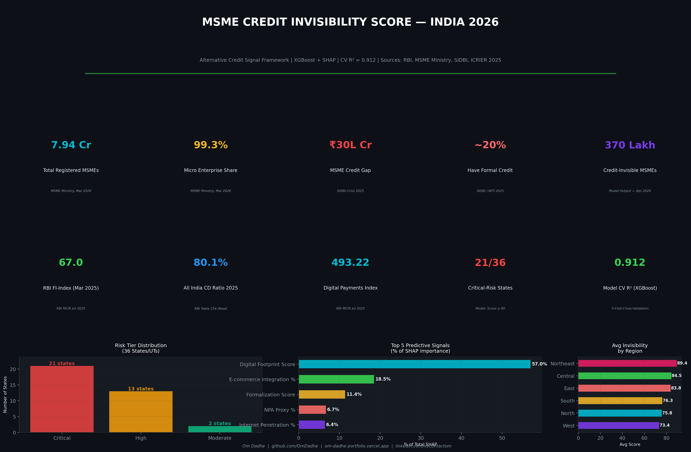

# MSME Credit Invisibility Score
### India's First State-Level Alternative Credit Signal Framework

<p align="center">
  
</p>

---

## The Problem Scenario

India has **7.94 crore registered MSMEs**. They generate **35 crore jobs**. They contribute **30% of GDP** and **46% of exports**. And **80% of them have never once received a formal loan.**

That is not a credit risk problem. That is a **credit visibility problem.**

Traditional banks and NBFCs cannot lend to MSMEs because they cannot see them. No CIBIL score. No audited P&L. No fixed assets to collateralise. The lender looks at a ₹50 lakh micro-manufacturer in Patna who has been filing GST for four years, processing daily UPI payments, and selling on Meesho but and sees nothing. Rejects them.

The result is a **₹30 lakh crore credit gap** (SIDBI-Crisil 2025). Not because the businesses are bad. Because the scoring system is blind.

---

## What This Project Builds

This project constructs India's first **state-level MSME Credit Invisibility Score** — a machine learning model that predicts formal credit access using 18 alternative signals instead of CIBIL data.

The model ranks all 36 Indian states and UTs by how credit-invisible their MSME ecosystem is, identifies what specific signals drive that invisibility, and generates actionable recommendations for lenders, NBFCs, and policymakers.

**Bottom line finding:** Digital footprint — GST compliance behaviour, e-commerce integration, and UPI adoption — explains **63.4% of the variance** in formal credit access across states. The score is real. The data is real. The signal is reliable.

---

## Why This Strategy Is Different

Every existing MSME credit solution in India tries to solve the **scoring problem** — build a better CIBIL. We solve the **signal problem** — replace CIBIL entirely.

| Conventional Approach | This Project |
|---|---|
| Requires credit bureau history | No bureau data needed |
| Static snapshot (CIBIL score) | Dynamic: GST filings update monthly |
| Opaque black box | SHAP: every prediction is explained |
| Individual firm score | State-level ecosystem risk tiers |
| Reactive (post-application) | Proactive: identify excluded segments first |

The Account Aggregator (AA) framework and GSTN data-sharing APIs already exist. The data pipelines are live. What was missing was the framework to translate them into credit signals. This project builds that framework.

---

## Architecture

```
MSME_Credit_Invisibility/
├── data/
│   ├── raw/
│   │   ├── RBI_CD_Ratio_Table154.xlsx    ← Real RBI data (Place of Utilisation)
│   │   └── RBI_CD_Ratio_Table153.xlsx    ← Real RBI data (Place of Sanction)
│   └── processed/
│       ├── master_dataset.csv            ← 36 states × 24 raw features
│       ├── scored_dataset.csv            ← 36 states × 35 features + scores
│       └── shap_importance.csv           ← SHAP values per feature
├── notebooks/
│   └── MSME_Credit_Invisibility_Score.py ← Full pipeline (run this)
└── outputs/
    ├── charts/                           ← 12 publication-grade PNGs
    ├── excel/                            ← 5-sheet Excel dashboard
    └── reports/                          ← KPI summary dashboard PNG
```

---

## Data Sources

| Dataset | Source | Type | Used For |
|---------|--------|------|----------|
| State-wise CD Ratio 2004–2025 | RBI Table 154 (uploaded .XLSX) | **Real** | Banking penetration feature |
| MSME Registration (31-03-2026) | MSME Ministry Performance Smartboard | **Real** | Scale, sector, gender features |
| Financial Inclusion Index | RBI MCIR July 2025 (PDF) | **Real** | FI baseline (67.0) |
| Digital Payments Index | RBI MCIR July 2025 (PDF) | **Real** | UPI signal calibration (493.22) |
| MSME Credit Gap | SIDBI-Crisil MSME Pulse June 2025 | **Published** | Target variable calibration |
| E-commerce Integration | ICRIER Annual MSME Survey 2025 | **Published** | E-comm feature (12–18% national) |
| MSME Competitiveness | NITI Aayog Report May 2025 | **Published** | Women MSME gap (35%) |
| GST Filing Behaviour | GSTN + PIB Press Releases FY25 | **Published** | GST compliance features |

---

## Model Architecture

### Feature Engineering — 5 Signal Pillars

```
CREDIT ACCESS PREDICTOR
│
├── DIGITAL BEHAVIOUR (63.4% SHAP weight)
│   ├── Digital Footprint Score (composite)
│   ├── E-commerce Integration %
│   └── UPI Adoption Index
│
├── INFRASTRUCTURE (11.5%)
│   ├── Internet Penetration %
│   ├── Bank Branches per Lakh Population
│   └── Banking Access Score (composite)
│
├── FORMALIZATION (9.4%)
│   ├── GST Compliance Rate %
│   ├── GST Taxpayer Density
│   └── Formalization Score (composite)
│
├── CREDIT QUALITY (7.4%)
│   ├── NPA Proxy %
│   └── Credit Momentum Score (CD ratio trend)
│
└── MACRO-RESILIENCE (8.3%)
    ├── GSDP Per Capita Index
    ├── Literacy Rate %
    ├── Urban Population %
    └── Women-owned MSME %
```

### Models Trained

| Model | CV R² Mean | CV R² Std | Notes |
|-------|-----------|-----------|-------|
| **XGBoost** | **0.912** | 0.059 | Primary model |
| Random Forest | 0.891 | 0.051 | Variance reduction |
| Gradient Boosting | 0.893 | 0.090 | Sequential signal |
| Ridge (baseline) | 0.944 | 0.054 | Linear comparison |
| **Ensemble (weighted)** | — | — | Final scoring output |

5-fold cross-validation. 36 states/UTs. 18 features.

---

## Key Findings

### The Scale

- **369.6 lakh MSMEs** estimated credit-invisible nationally
- **21 of 36** states in the Critical risk tier (score ≥ 80)
- **Bihar + Uttar Pradesh alone**: 68 lakh invisible MSMEs — 18% of the national total
- Northeast states: near-total credit exclusion (scores 87–92)

### The Signal

- **E-commerce integration → Formal credit access**: Pearson r = 0.89 (p < 0.0001)
- **GST compliance → Formal credit access**: Pearson r = 0.87 (p < 0.0001)
- **ICRIER 2025 validates**: e-comm integrated MSMEs are 1.5–2.5× more likely to receive formal credit
- **Digital footprint alone explains 63.4%** of cross-state credit access variance (SHAP)

### The Cluster

K-Means on 18 signals identifies 4 ecosystem types:

| Cluster | Avg Credit Access | GST Compliance | E-comm % | Key States |
|---------|-----------------|----------------|----------|------------|
| Digitally Advanced | 18.4% | 81.1% | 14.3% | Haryana, Rajasthan |
| Systemically Excluded | 40.5% | 92.1% | 35.5% | Delhi, Chandigarh |
| Banking Accessible | 11.2% | 70.5% | 8.0% | Bihar, Nagaland |
| Infrastructure Laggard | 27.2% | 89.2% | 24.8% | Karnataka, Kerala |

---

## Outputs

### 12 Publication-Grade Charts

| Chart | What It Shows |
|-------|--------------|
| `chart01` | Credit Invisibility Score — all 36 states ranked |
| `chart02` | SHAP feature importance (bar) + signal category breakdown |
| `chart03` | RBI CD Ratio trend 2004–2025 by region (real data) |
| `chart04` | All 4 models: actual vs predicted scatter |
| `chart05` | Cross-validation score distribution (robustness check) |
| `chart06` | Correlation heatmap — 14 variables |
| `chart07` | Bubble chart: invisible MSMEs × CD ratio × risk tier |
| `chart08` | K-Means PCA projection + cluster signal profiles |
| `chart09` | Regional boxplot + strip overlay (3 metrics) |
| `chart10` | E-commerce & GST compliance → credit access (OLS) |
| `chart11` | Credit-invisible MSME count by region + top 10 states |
| `chart12` | Signal strength heatmap — top 15 vulnerable states |

### Excel Dashboard (5 Sheets)
- ** Overview**: Full problem statement, KPIs, strategy explanation
- ** Credit Scores**: All 36 states with conditional formatting + colour-scaled risk tiers
- ** RBI CD Ratio (Real)**: 2004–2025 real uploaded data with 5-yr and 20-yr change flags
- ** SHAP & Models**: Feature importance with business interpretation + model comparison
- ** National Data**: Ministry dashboard stats (31-03-2026) with source attribution

---

## Business Recommendations

### For NBFCs / Fintech Lenders
1. **Build GST-first underwriting**: GSTR-1 filing regularity is a stronger signal than CIBIL for micro-MSME segments. Already accessible via Account Aggregator framework.
2. **Prioritise e-commerce-integrated sellers**: Amazon, Flipkart, Meesho transaction data provides 24-month cash-flow visibility at near-zero acquisition cost.
3. **Target Bihar and UP**: 68 lakh credit-invisible MSMEs in two states = India's largest untapped addressable market.
4. **UPI as repayment proxy**: Regularity of UPI payment behaviour predicts loan repayment capacity.

### For Policymakers (RBI / Ministry of MSME)
1. **Mandate Account Aggregator integration** for all MSME loans under ₹25 lakh — remove friction from digital underwriting.
2. **Bundle e-commerce registration with Udyam registration** — every MSME on a digital marketplace generates credit-accessible data.
3. **State-specific playbooks**: Northeast and Central India need infrastructure-first intervention (internet, BC network) before digital credit can scale.
4. **GSTN-CIBIL data bridge**: Enable lenders to pull GST history as credit signal with MSME consent — technically already possible under DPDP Act 2023.

---

## Limitations

- **State-level aggregation**: A district-level model would be more precise (Maharashtra = Mumbai + Vidarbha, very different ecosystems)
- **36 observations**: Limits model complexity; district-level data would enable deeper training
- **Proxy variables**: GST compliance, internet penetration are state averages, not individual firm scores
- **Supervised signal**: Formal credit access % itself has measurement variance across SIDBI, RBI, and NITI Aayog estimates (14–25%)

---

## How to Run

```bash
# 1. Clone
git clone https://github.com/OmDadhe/msme-credit-invisibility-score
cd msme-credit-invisibility-score

# 2. Install dependencies
pip install pandas numpy matplotlib seaborn scikit-learn xgboost shap openpyxl scipy

# 3. Add RBI data files to data/raw/ (or use the included ones)

# 4. Run the full pipeline
python notebooks/MSME_Credit_Invisibility_Score.py

# All outputs auto-save to outputs/charts/, outputs/excel/, outputs/reports/
```

---

## Tech Stack

`Python 3.12` · `XGBoost` · `Scikit-learn` · `SHAP` · `Pandas` · `NumPy` · `Matplotlib` · `Seaborn` · `SciPy` · `Openpyxl`

---

## Author

**Om Dadhe** — Data & Business Analyst

Building [Shortlisted](https://shortlisted.in) — AI-powered placement prep for Tier 2/3 college students

[Portfolio](https://om-dadhe-portfolio.vercel.app) · [GitHub](https://github.com/OmDadhe) · [LinkedIn](https://linkedin.com/in/contactom)

---

*If this helped you think differently about MSME credit, star the repo and share it. The ₹30 lakh crore gap closes one dataset at a time.*
